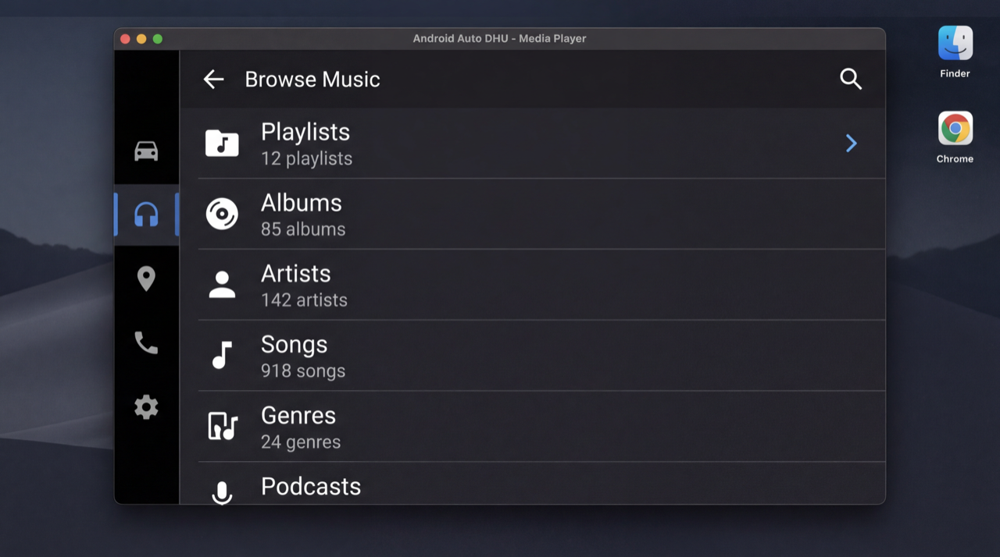
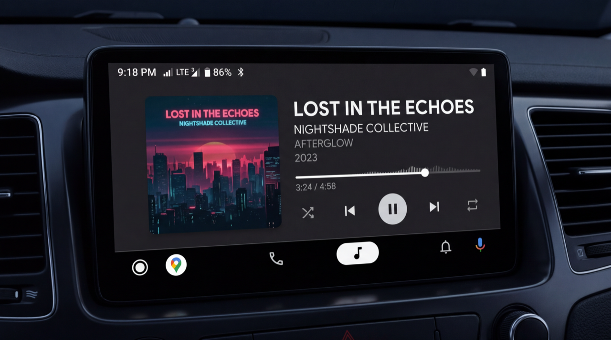

# Power Ampache 2 — plugin template & Android Auto (dev)

This repository is the **Power Ampache 2 plugin template**: `domain`, `data`, `app`, and `PowerAmpache2Theme` modules with Clean Architecture. **Android Auto / Media3** work is concentrated in **`app/`** (see [`AGENTS.md`](AGENTS.md)).

On branch **`cursor-cloud/dev-main-4dc1`**, development focuses on a **functional** Android Auto browse/playback path via **`Pa2MediaLibraryService`**, **`MusicFetcher`**, and the host’s **`PA2DataFetchService`** IPC. **Known bugs** remain and will be addressed **before release**; the host binding model is **confirmed** (see [`START_HERE.md`](START_HERE.md)).

## Design reference (DHU)

Static reference images live under **`mockups/assets/`** (same artwork as the design branch). The **head unit** renders now playing; the plugin supplies **Media3** session and metadata — these PNGs are **visual references**, not a promise of pixel-perfect UI on every device.

| | |
| --- | --- |
|  | *Hero / branding reference* |
|  | *DHU — browse (reference)* |
|  | *DHU — now playing (reference)* |

**Full mockups & research** (UX notes, web mockup, agent pack) are on branch **`mockups`** — see that branch’s [`README`](https://github.com/shahzebqazi/PowerAmpache2PluginTemplate/blob/mockups/README.md) and [`docs/README.md`](https://github.com/shahzebqazi/PowerAmpache2PluginTemplate/blob/mockups/docs/README.md) on GitHub.

## Quick links

| Doc | Purpose |
| --- | --- |
| [`START_HERE.md`](START_HERE.md) | Onboarding, build notes, Android Auto / DHU, **upstream contribution** checklist |
| [`AGENTS.md`](AGENTS.md) | Branch policy, commit format, browse/search notes, DHU iteration script |

## Branches (this fork)

| Branch | Role |
| --- | --- |
| **`main`** | Tracks **`upstream/main`** only (`icefields/PowerAmpache2PluginTemplate`). No feature work; sync with `git fetch upstream` and `git reset --hard upstream/main` when aligning with upstream. |
| **`cursor-cloud/dev-main-4dc1`** | Integration branch for this fork; topic branches use the **`cursor-cloud/`** prefix. |
| **`mockups`** | Documentation and design assets **only** (no app code on that branch). |

## Contributing upstream (`PluginAndroidAuto`)

One-off PRs toward upstream can target **`PluginAndroidAuto`** on `icefields/PowerAmpache2PluginTemplate` when the maintainer agrees. Use a **topic branch name that includes the contributor** (e.g. `cursor-cloud/shahzebqazi-PluginAndroidAuto-<topic>-5244`) and follow **Contributing upstream** in [`START_HERE.md`](START_HERE.md). **Do not** change **`domain/`** or **`data/`** upstream unless the **developer explicitly approves**. Match upstream **CI** and any **contribution / CLA** rules published on the upstream repo.
