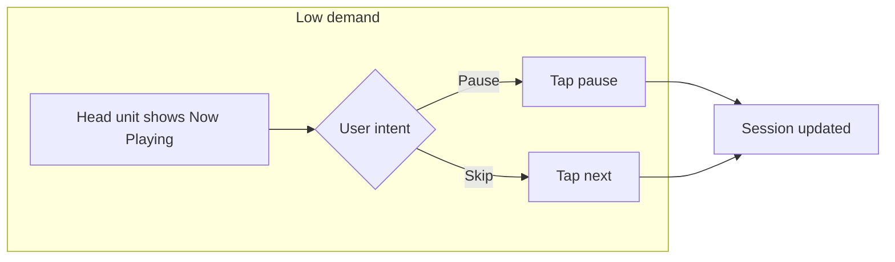
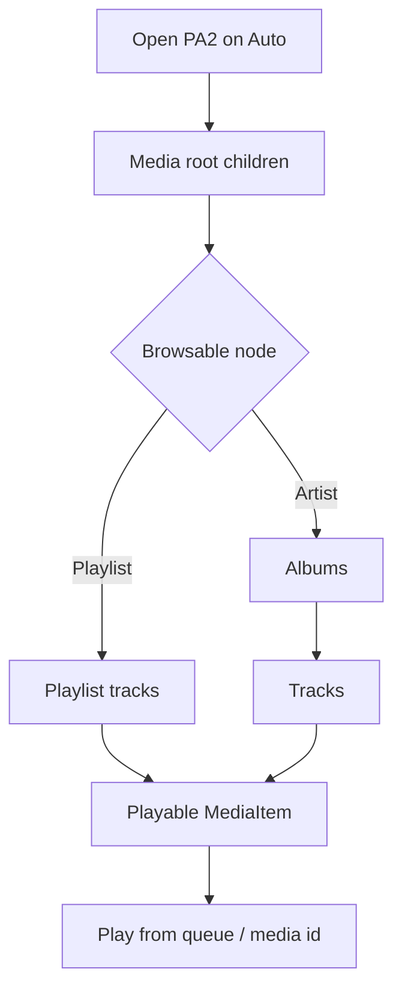

# What drivers actually do — music on Android Auto

These tasks describe **Power Ampache 2** in a **MediaBrowser**-style world on **Android Auto**. Methodology detail lives in [../agents/research-methodology.md](../agents/research-methodology.md).

## The tasks that matter most

Rough priority — what should feel effortless at speed:

| ID | Task | What success feels like | How people usually trigger it |
|----|------|-------------------------|-------------------------------|
| **T1** | Resume / pause | Music starts or stops without hunting | Screen, steering wheel, assistant |
| **T2** | Skip next / previous | Change track without opening folders | Same |
| **T3** | Play something familiar | Music soon, few decisions | Voice (“Play …”) or short browse |
| **T4** | Pick from recents / continue | Back to the last thing without deep menus | Root → recents or “continue” |
| **T5** | Search | Find a track when browse is too deep | **Voice** preferred over typing while moving |

We **hypothesize** (needs user testing) that **T1–T3** cover the bulk of acceptable “eyes forward” use for streaming; **T4–T5** need clear guardrails ([05-design-guardrails-checklist.md](05-design-guardrails-checklist.md)).

## A bit more detail

**Resume / pause** — One clear control, stable place on the head unit, learned icon. Low visual, manual, and mental effort when the UI does not move around.

**Play something familiar (browse)** — Often two or three steps: open source → pick playlist or album → pick track. Cost jumps with **depth** and **list length**. Mitigations: voice, flat **recents**, **continue listening**.

**Search** — With a keyboard and long results, demand is **high**. With voice and good recognition, it drops. Prefer voice for moving vehicles.

## Flow — resume, then skip

## Flow — browse until something plays

**Practical implication:** Keep the **first** level after root **short and scannable**. Surface **continue listening**, **playlists**, and **recent** before sending people down a long artist → album → track path — Ampache can go deep.

## How PA2 features line up

| Capability | Tasks | Note |
|------------|-------|------|
| Streaming + offline | T1–T4 | Whether **offline** shows clearly on the host is an **open question** |
| Multiple accounts | T3–T5 | Switching servers in the car is painful; **one active session** is easier |
| Smartlists / search | T3, T5 | Voice and shallow entry reduce depth |
| Queue editing | Near T2 | Heavy reorder on Auto is rare; **phone** is better for big edits |

## Demand at a glance

| Task | Eyes | Hands | Thinking |
|------|------|-------|------------|
| T1 | Low | Low | Low |
| T2 | Low | Low | Low |
| T3 | **High** if deep | Medium | Medium–high |
| T4 | Medium | Medium | Medium |
| T5 voice | Low–med | Low | Medium |
| T5 typing | **High** | **High** | High |

## Pattern scan (ethical)

We document behaviours from **public** help and design docs — not by scraping other apps or copying pixels. A starter table lives in [03-music-auto-ux-pattern-table.md](03-music-auto-ux-pattern-table.md); fill it as you find solid references.

---

*Last reviewed: 2026-04-07*
